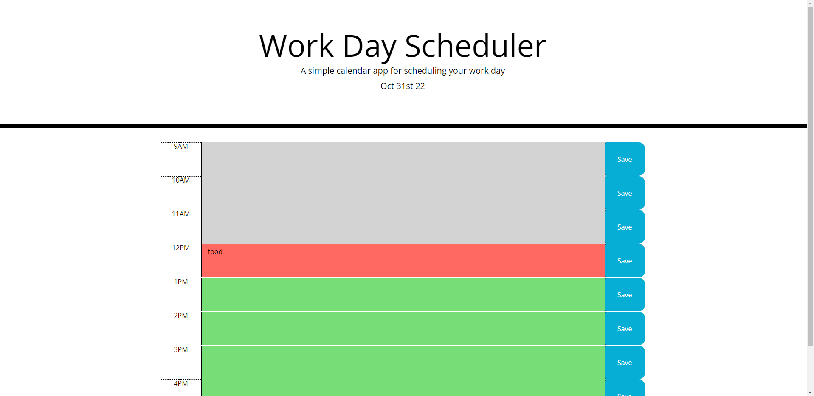

# Day-planner

## Description

The Purpose of this day planner is to help the user keep an organized plan of all of the events during their day and updates based on time of day.

## Installation

N/A

## Usage

Use this day planner to list events or tasks you have to do throughout your workday

## Credits

N/A

## License

Please refer to the license present in the corresponding Github repository.

link to deployed page --
https://walleric23.github.io/Day-planner/

